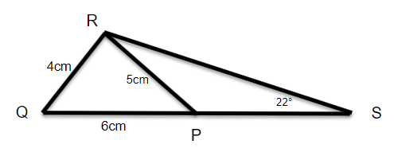

# Mathematical Methods 2 - Exam Paper - 2022 - Summer

## Instructions

**Time Allowed**: 2 hours

**Instructions**:  Answer 4 questions. All questions carry equal marks

The use of programmable or text storing calculators is expressly forbidden.

Please note that where a candidate answers more than the required number of questions, the examiner will mark all questions attempted and then select the highest scoring ones.

***Requirements for this paper:***

1. ***Log Tables***
2. ***Calculators***

## Question 1 (Total Marks 25)

Differentiate the following with respect to the variable:

| Question |                         |               |
|----------|-------------------------|---------------|
| 1.       | $s=3t^{4.5}-5t^{-2}$    | **(3 Marks)** |
| 2.       | $y=5e^{3x}$             | **(2 Marks)** |
| 3.       | $s=\dfrac{5}{t^{3}}$    | **(3 Marks)** |
| 4.       | $y=\cos 3x + 3 \sin 2x$ | **(4 Marks)** |
| 5.       | $y=(x^2 + 2)^4$         | **(3 Marks)** |
| 6.       | $y=\dfrac{2x+1}{x^2-3}$ | **(5 Marks)** |
| 7.       | $y=2x^3\cos 3x$         | **(5 Marks)** |

## Question 2 (Total Marks 25)

### Question 2(a) (7 Marks)

A surveyor measures the angle of elevation of the top of a perpendicular building as 19°. He moves 120 meters nearer the building and finds the angle of elevation is now 47°. Determine the height of the building.

### Question 2(b) (9 Marks)

Identify the following graphs. State the period and the range:

| #  | Graph                                                                                   |
|----|-----------------------------------------------------------------------------------------|
| 1. |  |
| 2. |  |
| 3. |  |

### Question 2(c) (7 Marks)

In the following diagram, `|PQ|` = 6cm, `|PR|` = 5cm, `|QR|`= 4cm and angle `|<PSR|` = 22°. Calculate the length of `|RS|`

### Question 2(d) (2 Marks)

Convert the following. Show your workings:

1. 225° to radians
2. $\dfrac{5 \pi}{3}$ radians to degrees

## Question 3 (Total Marks 25)

### Question 3(a) (18 Marks)

A liquid cools in such a way that at `t` minutes, its temperature, `T` °C, can be modelled by the formula $T = 20 + 60e^{-0.1t}$, where $t \geq 0$.

1. What is the initial temperature? **(2 Marks)**
2. Sketch the graph for the first hour of cooling in intervals of 10 minutes. **(6 Marks)**
3. Explain why the temperature is always above `20°C`. **(2 Marks)**
4. Find the rate of cooling when `t` = 60. **(4 Marks)**
5. Determine mathematically, the time it will take for the liquid to cool to `32.5 °C` **(4 Marks)**

### Question 3(b) (7 Marks)

Calculate the area between the curve $y = 4x - x^{2}$ and the x axis.

## Question 4 (Total Marks 25)

### Question 4(a) (10 Marks)

A car, starting at time `t = 0`, travels a distance of `s` metres in `t` seconds where: $s = 30t - \frac{9}{4}t^{2}$

1. Find the speed of the car after 2 seconds. **(4 Marks)**
2. After how many seconds is the speed of the car equal to zero? **(3 Marks)**
3. Find the distance travelled by the car up to the time its speed is zero. **(3 Marks)**

### Question 4(b) (7 Marks)

There were 50 rabbits on an island. After six months the number of rabbits had increased to 350. If the number of rabbits increased exponentially, then how many rabbits will there be at the end of one year?

### Question 4(c) (4 Marks)

The half life of Plutonium-239 is 24,120 years. Starting with 60 atoms of Plutonium-239, how much would remain after 10,000 years?

### Question 4(d) (4 Marks)

Solve the following: $8 =(1+e^{-\frac{t}{2}})$

## Question 5 (Total Marks 25)

### Question 5(a) (13 Marks)

Integrate the following:

| Question |                              |               |
|----------|------------------------------|---------------|
| 1.       | $\int(6x^{5} - 6x)dx$        | **(3 Marks)** |
| 2.       | $\int(3e^{x} + 5)dx$         | **(3 Marks)** |
| 3.       | $\int(x^{-1} + 3.2)dx$       | **(3 Marks)** |
| 4.       | $\int(2\cos 3x + \sin 2x)dx$ | **(4 Marks)** |

### Question 5(b) (12 Marks)

An automatic valve controls the flow of gas $R cm^3/s$, in an experiment. The flow of gas varies with the time, *t* seconds, as given by the equation $R=8t-t^2$. Find the following:

1. $\frac{dR}{dt}$, the rate of change of R with respect to t **(3 Marks)**
2. The value of $\frac{dR}{dt}$ after 6 seconds **(2 Marks)**
3. The time when the rate of flow is at a maximum **(4 Marks)**
4. After how many seconds is the rate of flow equal to $2cm^3/s$ **(3 Marks)**

## Paper College Details

College: Technological University of the Shannon: Midlands Midwest  
Module Title: Mathematical Methods 2  
Module Code: MATH06072  
Year of Study: 1  
Year: 2022 - Summer  

### Programmes

| Code           | Programme                                |
|----------------|------------------------------------------|
| LC\_SMEDM\_KMY | Bsc. (Honours) Medical Technology        |
| LC\_SMEDM\_JMY | Bsc. Medical Technology                  |
| LC\_SMEDM\_IMY | Higher Certificate in Medical Technology |
| LC\_SCLIM\_KMY | Bsc. (Honours) Clinical Technology       |

### Examiners

| Examiner         |          |
|------------------|----------|
| Aisling Lynch    | Internal |
| Mr. Peter Murray | External |
