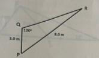

# Mathematical Methods 2 - Exam Paper - 2023 - Summer

**Time Allowed**: 2 hours

**Instructions**:  Answer 4 questions. All questions carry equal marks

The use of programmable or text storing calculators is expressly forbidden.

Please note that where a candidate answers more than the required number of questions, the examiner will mark all questions attempted and then select the highest scoring ones.

***Requirements for this paper:***

1. ***Log Tables***
2. ***Calculators***

## Question 1 (Total Marks 25)

### Question 1(a) [12 Marks]

Solve the triangle shown below:

### Question 1(b) [3 Marks]

When the angle of elevation of the sun is 10°, an upright flagpole casts a shadow of length of 20m. Calculate the height of the pole.

## Question 1(c) [4 Marks]

Solve for x:

$2.3\ln{\dfrac{1.3}{x^2}}=9.1$

### Question 1(d) [6 Marks]

For the function shown below, determine the second order differential $f(x)$.

$f(x) =-6x+\frac{1}{\sqrt[3]{x}} - \frac{1}{4x^3}$
