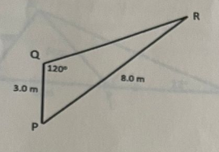
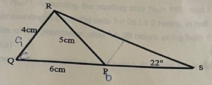

# Mathematical Methods 2 - Exam Paper - 2023 - Summer

**Time Allowed**: 2 hours

**Instructions**:  Answer any 4 out of 5 questions. All questions carry equal marks

The use of programmable or text storing calculators is expressly forbidden.

Please note that where a candidate answers more than the required number of questions, the examiner will mark all questions attempted and then select the highest scoring ones.

***Requirements for this paper:***

1. ***Log Tables***
2. ***Calculators***

## Question 1 (Total Marks 25)

### Question 1(a) [12 Marks]

Solve the triangle shown below:

### Question 1(b) [3 Marks]

When the angle of elevation of the sun is 10°, an upright flagpole casts a shadow of length of 20m. Calculate the height of the pole.

## Question 1(c) [4 Marks]

Solve for x:

$2.3\ln{\dfrac{1.3}{x^2}}=9.1$

### Question 1(d) [6 Marks]

For the function shown below, determine the second order differential $f(x)$.

$f(x) =-6x+\dfrac{1}{\sqrt[3]{x}} - \dfrac{1}{4x^3}$

## Question 2 (Total Marks 25)

### Question 2(a) [7 Marks]

Find the area of the triangle QRS below.

### Question 2(b) [8 Marks]

Differentiate the following with respect to the variable:

1. $y = \dfrac{5}{3e^{4x}}$
2. $y = \frac{4}{7}e^{-\frac{2}{4}x}$
3. $y = \frac{2}{3}\ln{3\pi x}$
4. $y = 3\sin{2\theta} - 2\cos{4\theta}$

### Question 2(c) [6 Marks]

Graph the function $y = \cos{2\theta}$ for $0° \geq \theta \leq 180°$ in intervals of 20°.

### Question 2(d) [4 Marks]

Solve the triangle, given one side of a triangle and two angles are:

$$a = 2, A = 30°, B = 40°$$

## Question 3 (Total Marks 25)

### Question 3(a) [15 Marks]

The number of cells N in a bacterial population in time t hours from the commencement of growth is given by $N = N_0e^{kt}$. Assuming the starting size $N_0 = 110$, and $k=1.7$.

1. Plot the graph representing N bacterial cells for 0 ≤ t ≤ 2 hours, in half-hour steps. **(8 marks)**
2. Determine the size of the population after 10.25 hours using both the formula and graph methods. **(4 marks)**
3. Determine the time for the population to increase 10 times the initial value. **(2 marks)**

### Question 3(b) [4 Marks]

Convert:

1. $\dfrac{5 \pi}{6}$ to degrees. **(2 marks)**
2. $180°$ to radians. **(2 marks)**

### Question 3(c) [6 Marks]

Use the chain rule to differentiate the following:

$$y = \sqrt{2x-1}$$

## Question 4 (Total Marks 25)

### Question 4(a) [4 Marks]

Use the product rule to differentiate the following:

$$y = x^2 \cos{2x}$$

### Question 4(b) [4 Marks]

Use the quotient rule to differentiate the following:
$$f(x) = \dfrac{x^2+1}{e^{2x}}$$

### Question 4(c) [8 Marks]

A man leaves a point walking at 5 km/h in a direction E30°N . A cyclist leaves the same point at the same time in a direction E40°S travelling at a constant velocity. Find the average velocity of the cyclist if the walker and cyclist are 60 km apart after 3.5 hours.

### Question 4(d) [9 Marks]

The isotope Technitium-99m has a decay constant of $3.2 \times 10^{-5}/sec$, you measure a current weight of 4 grams of the isotope. Given the following formula:

$$m = m_0e^{-\lambda t}$$

Determine:

1. The mass of the isotope 24 hours previous to the initial measurement. **(5 marks)**
2. The half-life in hours. **(4 marks)**

## Question 5 (Total Marks 25)

### Question 5(a) [12 Marks]

An objects position $S$ in relation to time $t$ can be expressed by the following equation:

$$S = 2t^3 - 3t^2 + t + 6$$

1. Derive the equations for the object's velocity, and acceleration. **(2 marks)**
2. On a single graph plot the objects position, velocity and acceleration from time 0 to 2.5 in intervals of 0.5 seconds. **(8 marks)**
3. Using ***your graph*** determine objects position, velocity and acceleration after 0.75 seconds. **(2 marks)**

### Question 5(b) [8 Marks]

1. $\int 4 + \frac{3}{7}x - 6x^2\ dx$ **(4 marks)**
2. $\frac{3}{x^2} + 3\sqrt{x}+3x^2 - 5\ dx$ **(4 marks)**

### Question 5(c) [5 Marks]

The velocity *v* of a body *t* seconds after a certain instant is:

$$(2.5t^2 + 6t)ms^{-1}$$

Find by integration how far it moves in the interval from t = 0 to t =10 s.

---

## Paper College Details

College: Technological University of the Shannon: Midlands Midwest  
Module Title: Mathematical Methods 2  
Module Code: MATH06100  
Year of Study: 1  
Year: 2022 - Summer  

### Programmes

| Code         | Programme                                        |
|--------------|--------------------------------------------------|
| LC_SMETH_IMY | Higher Certificate in Science Medical Technology |
| LC_SMETM_JMY | Bsc. Medical Technology                          |
| LC_SMETM_KMY | Bsc. (Honours) Medical Technology                |

### Examiners

| Examiner            |          |
|---------------------|----------|
| Patrick Leydon      | Internal |
| Mr. Padraig Herbert | External |
